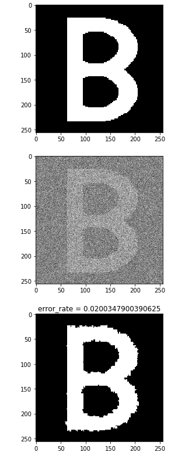

# semi-markov-image-segmentation
This repository contains the code for our final engineering project. This project aims to use semi-markov hidden model to improve an image segmentation task.

Using Markov Chains ton segment images carries a fundamental problem. By definition of the markov chain, the waiting time in a state follows a geometric law. Therefore, we try to modelize this waiting time using semi-markov chains to correct this problem. 

Reconstruction done in an unsupervised fashion using semi-markov hidden chains

